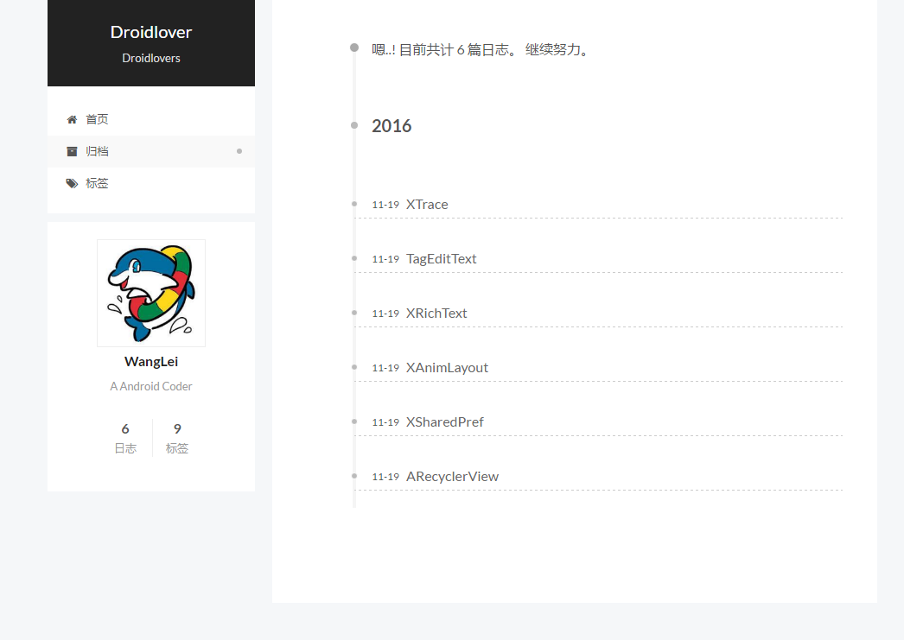
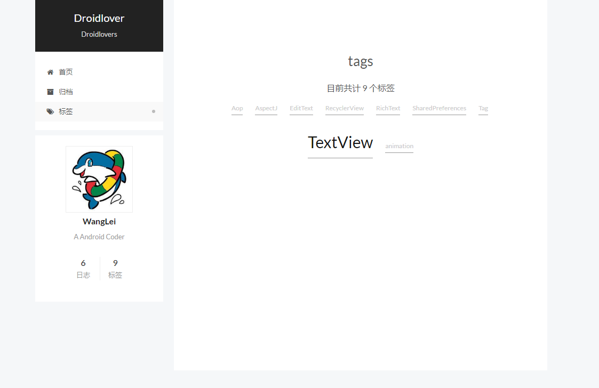
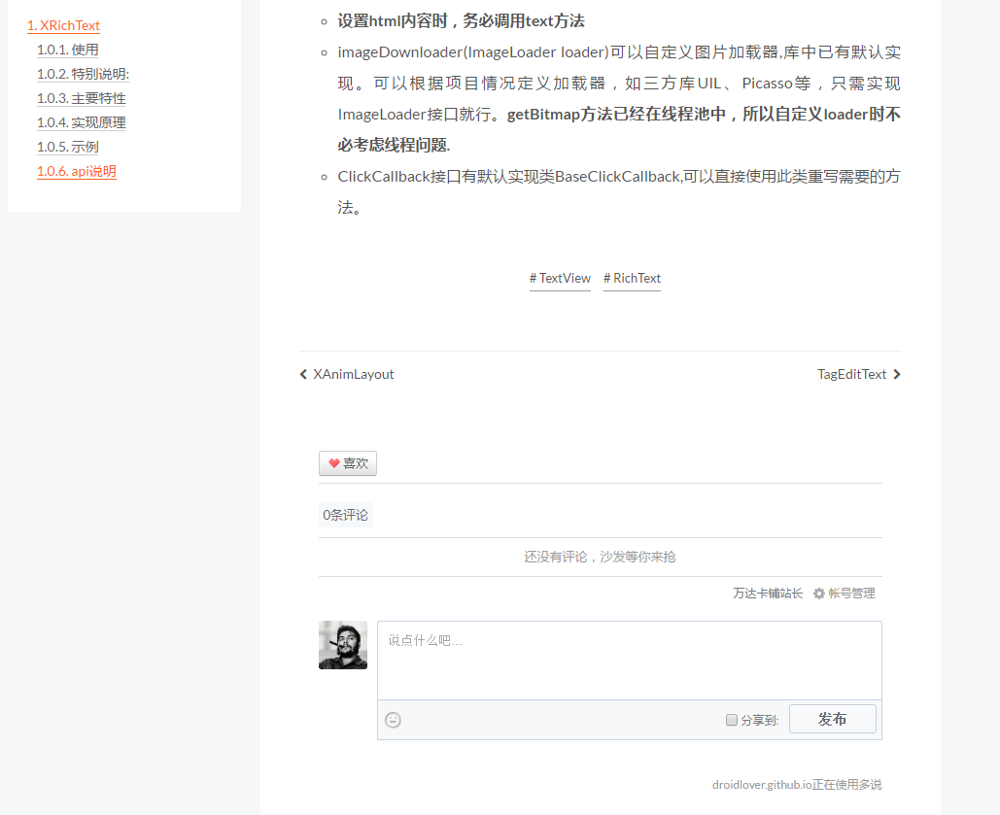

# Hexo 博客搭建指南

Hexo的简洁、神秘让我跃跃欲试，在使用过程中遇到了很多问题，整理此文，一是方便其他技术人搭建自己的博客，二是给自己的学习之旅做个总结。本文**未完结**，欢迎`star`、`fork`，如果有错误，请不吝指出。
我搭建的博客地址：[**limedroid.github.io**](https://limedroid.github.io)

<p align="center">
  
</p>
<p align="center">
  
</p>
<p align="center">
  
</p>

## 1 Hexo介绍

[Hexo](https://hexo.io/zh-cn/)是基于`NodeJs`的静态博客框架，简单、轻量，其生成的静态网页可以托管在`Github`和`Heroku`上。

* 超快速度
* 支持MarkDown
* 一键部署
* 丰富的插件

> 下面以我的博客为例，limedroid.github.io

## 2 环境准备

### 2.1 安装node.js

去[nodejs官网](https://nodejs.org/en/download/)下载对应系统的安装包，按提示安装。

检验安装成功：
```
$ node -v
```

### 2.2 安装hexo

```
$ npm install hexo-cli -g
```

注意：Mac系统，则需要  
```
$ sudo npm install hexo-cli -g
```

## 3 利用Hexo搭建一个博客

### 3.1 创建博客目录`limedroid.github.io`

```
$ hexo init limedroid.github.io
$ cd limedroid.github.io
$ npm install
```

### 3.2 生成静态页面

```
$ hexo clean
$ hexo g
```
> g 即generate

### 3.3 运行

```
$ hexo s
```

> s 即server

然后打开浏览器，输入地址 **localhost:4000** 即可看到效果

## 4 发一篇文章试试

### 4.1 命令方式

```
$ hexo new test
```

此时会在`source/_posts`目录下生成`test.md`文件，输入些许内容，然后保存.

生成下，看看效果

```
$ hexo clean
$ hexo g
$ hexo s
```

访问 **localhost:4000** 即可

### 4.2 直接方式

在 **source/_posts/**下新建一个`.md`文件也可

## 5 配置

网站的设置大部分都在**_config.yml**文件中，详细配置可以查看[官方文档](https://hexo.io/zh-cn/docs/configuration.html)

下面只列出简单常用配置

* **title** -> 网站标题
* **subtitle** -> 网站副标题
* **description** -> 网站描述
* **author** -> 您的名字
* **language** -> 网站使用的语言

坑：**进行配置时，需要在冒号:后加一个英文空格**

```
title: Droidlover
```

## 6 换一个好看的主题

Hexo 中有很多主题，可以在[官网](https://hexo.io/themes/)查看。
这里我推荐[hexo-theme-next](https://github.com/iissnan/hexo-theme-next)，下面列举更换主题的一般套路：

### 6.1 下载主题资源

```
$ git clone https://github.com/iissnan/hexo-theme-next themes/next
```

### 6.2 应用下载的主题

在网站配置文件**_config.yml**中，配置**theme**

```
theme: next
```

> next是主题名称，具体的可查看主题的文档

### 6.3 主题其他配置

可在`/theme/{theme}/_config.yml` 主题的配置文件下进行主题的配置。

接下来，可以执行万能的调试命令看看效果

```
$ hexo clean
$ hexo g
$ hexo s
```

## 7 部署到Github

### 7.1 有个github账号xxx

### 7.2 创建一个xxx.github.io的public仓库
如果您的账户名是limedroid,则需要创建一个limedroid.github.io的public仓库.

### 7.3 安装 [hexo-deployer-git](https://github.com/hexojs/hexo-deployer-git)

```
$ npm install hexo-deployer-git --save
```

### 7.4 网站配置git
在网站的`_config.yml`中配置deploy

```
deploy:
  type: git
  repo: <repository url>
  branch: [branch]
```

> `branch`为分支，默认为`master`,可以不配置
> `repo`为仓库地址，在github上新建仓库后，可复制此地址

### 7.5 部署

```
$ hexo d
```

> d 即deploy


## 8 贴标签，方便搜索

### 8.1 两个确认

* 确认站点配置文件有 
```
tag_dir: tags
```
* 确认主题配置文件有
```
tags: tags
```

### 8.2 新建tags页面

```
$ hexo new page tags
```
此时会在`source/`下生成`tags/index.md`文件

### 8.3 修改source/tags/index.md

```
title: tags
date: 2015-10-20 06:49:50
type: "tags"
comments: false
```

> date 可保持系统生成的时间，
```
type: "tags"
comments: false
```
很重要

### 8.4 在文章中添加tags

在文章`xx.md`中添加：

```
tags: 
	- Tag1
	- Tag2
	- Tag3
```

多个Tag可按上面的格式添加。

其文件头部类似：

```
title: TagEditText
date: 2016-11-19 10:44:25
tags: 
	- Tag1
	- Tag2
	- Tag3
```


## 9 分类，给文章归档

### 9.1 两个确认

* 确认站点配置文件打开了
```
category_dir: categories
```
* 确认主题配置文件打开了
```
categories: /categories
```

### 9.2 新建categories文件

```
$ hexo new page categories
```

此时会在`source`目录下生成`categories/index.md`文件

### 9.3 修改categories/index.md

```
title: categories
date: 2015-10-20 06:49:50
type: "categories"
comments: false
```

> date 可保持系统生成的时间，
```
type: "categories"
comments: false
```
很重要

### 9.4 在文章中添加categories

在文章xx.md中添加：

```
categories: 
	- cate
```

其文件头部类似：

```
title: TagEditText
date: 2016-11-19 10:44:25
categories: 
	- cate
```

## 10 添加评论功能

评论功能在国内一般使用[多说](http://duoshuo.com/)。

### 10.1 注册[多说](http://duoshuo.com/)账号

### 10.2 创建站点

需要注意的是，填写的**多说域名**不能更改，会在后面使用，在这里我配置成droidlover

### 10.3 配置

在hexo主题配置文件中搜索：
```
duoshuo_shortname
```
，然后打开开关，配置成前面设置的多说域名，如下：
```
duoshuo_shortname: droidlover
```

有时，可能需要一段js

```
<!-- 多说评论框 start -->
	<div class="ds-thread" data-thread-key="请将此处替换成文章在你的站点中的ID" data-title="请替换成文章的标题" data-url="请替换成文章的网址"></div>
<!-- 多说评论框 end -->
<!-- 多说公共JS代码 start (一个网页只需插入一次) -->
<script type="text/javascript">
var duoshuoQuery = {short_name:"droidlover"};
	(function() {
		var ds = document.createElement('script');
		ds.type = 'text/javascript';ds.async = true;
		ds.src = (document.location.protocol == 'https:' ? 'https:' : 'http:') + '//static.duoshuo.com/embed.js';
		ds.charset = 'UTF-8';
		(document.getElementsByTagName('head')[0] 
		 || document.getElementsByTagName('body')[0]).appendChild(ds);
	})();
	</script>
<!-- 多说公共JS代码 end -->
```

现在，你可以运行看下效果了:)


## 11 加介绍页面，让全世界认识你


